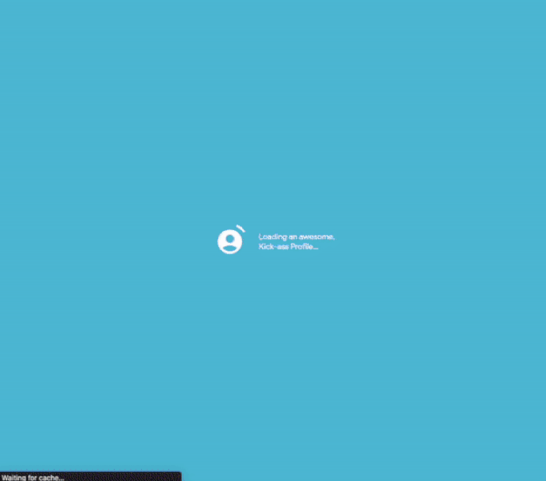

# Flutter Web Codelab (pt. 1) - Setting Up Your Flutter Web App

## Overview

Welcome to the exciting world of Flutter Web!

[**Flutter**](https://flutter.dev/) is an open-source UI Toolkit supported by Google for building beautiful, natively-compiled user interfaces in a multi-platform fashion, using [**Dart**](https://dart.dev/), another open-source programming language supported by Google, as its core language.

[**Flutter for Web**](https://flutter.dev/multi-platform/web) provides the lowest barrier to entry when it comes to becoming a profilic Flutter developer. Most of the concepts learned in Flutter can be applied in a multi-platform scenario, and web is not an exception, so join us in building compelling web apps by going through the codelabs in this series.

### NOTE: THIS IS NOT A BEGINNER CODELAB

(If you're looking for more beginner content, please visit some of my other codelabs [here](https://romanjustcodes.web.app/#/workshops)). If you're up for the challenge, then proceed.

This is a codelab series focused on Flutter Web, in which you'll learn the following:

- Building Layouts in Flutter
- Adding Custom Fonts
- Page Navigation and Nested Navigation using GoRouter
- Animations (Flutter and External Libraries (i.e. Rive))
- State Management using Riverpod
- Persisting state in Local Storage
- Responsive UI
- Firebase Integration:
  - Deploy your web apps using Firebase Hosting
  - Pull data for your web apps from Firebase Cloud Firestore
  
  
